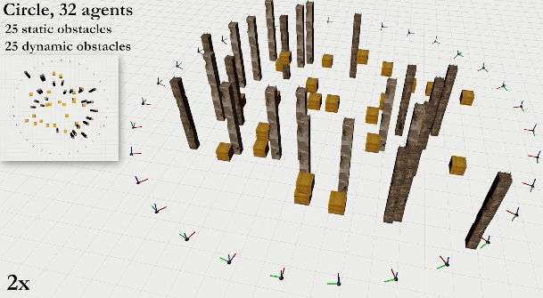

# MADER: Trajectory Planner in Multi-Agent and Dynamic Environments #


### **Accepted for publication in the IEEE Transactions on Robotics (T-RO)**


Single-Agent               |  Multi-Agent           | 
:-------------------------:|:-------------------------:|
[](https://www.youtube.com/watch?v=aoSoiZDfxGE "MADER: Trajectory Planner in Multi-Agent and Dynamic Environments")      |  [](https://www.youtube.com/watch?v=aoSoiZDfxGE "MADER: Trajectory Planner in Multi-Agent and Dynamic Environments") |  
[](https://www.youtube.com/watch?v=aoSoiZDfxGE "MADER: Trajectory Planner in Multi-Agent and Dynamic Environments")       |  [](https://www.youtube.com/watch?v=aoSoiZDfxGE "MADER: Trajectory Planner in Multi-Agent and Dynamic Environments")    |  

## Citation

When using MADER, please cite [MADER: Trajectory Planner in Multi-Agent and Dynamic Environments](https://arxiv.org/abs/2010.11061) ([pdf](https://arxiv.org/abs/2010.11061), [video](https://www.youtube.com/watch?v=aoSoiZDfxGE)):

```bibtex
@article{tordesillas2020mader,
  title={{MADER}: Trajectory Planner in Multi-Agent and Dynamic Environments},
  author={Tordesillas, Jesus and How, Jonathan P},
  journal={IEEE Transactions on Robotics},
  year={2021},
  publisher={IEEE}
}
```

## General Setup

MADER has been tested with 
* Ubuntu 16.04/ROS Kinetic
* Ubuntu 18.04/ROS Melodic

The backend optimizer can be either Gurobi (recommended, used by default) or NLOPT (discouraged): 

* To use [`Gurobi`](https://www.gurobi.com/), install the [Gurobi Optimizer](https://www.gurobi.com/products/gurobi-optimizer/). You can test your installation typing `gurobi.sh` in the terminal. Have a look at [this section](#issues-when-installing-gurobi) if you have any issues.
* To use [`NLOPT`](https://nlopt.readthedocs.io/en/latest/), set `USE_GUROBI` to `OFF` in the [CMakeList.txt](https://github.com/mit-acl/mader/blob/master/mader/CMakeLists.txt). 

Then simply run this commands:

```bash
cd ~/ && mkdir ws && cd ws && mkdir src && cd src
git clone https://github.com/mit-acl/mader.git
cd ..
#bash bash mader/install_nlopt.sh      #ONLY if you are going to use NLOPT, it'll install NLopt v2.6.2
bash src/mader/install_and_compile.sh      
```

The script [install_and_compile.sh](https://github.com/mit-acl/mader/blob/master/install_and_compile.sh) will install [CGAL v4.12.4](https://www.cgal.org/), [GLPK](https://www.gnu.org/software/glpk/) and other ROS packages (check the script for details). It will also compile the repo. This bash script assumes that you already have ROS installed in your machine. 

### Running Simulations

#### Single-agent
```
roslaunch mader single_agent_simulation.launch
```
Now you can press `G` (or click the option `2D Nav Goal` on the top bar of RVIZ) and click any goal for the drone. 

To run many single-agent simulations in different random environments, you can go to the `scripts` folder and execute `python run_many_sims_single_agent.py`.

#### Multi-agent

> **Note**: For a high number of agents, the performance of MADER improves with the number of CPUs available in your computer. 

Open four terminals and run these commands:

```
roslaunch mader mader_general.launch type_of_environment:="dynamic_forest"
roslaunch mader many_drones.launch action:=start
roslaunch mader many_drones.launch action:=mader
roslaunch mader many_drones.launch action:=send_goal
```

(if you want to modify the drone radius, you can do so in `mader.yaml`). For the tables shown in the paper, the parameters (drone radius, max vel,...) used are also detailed in the corresponding section of the paper


#### Octopus Search
You can run the octopus search with a dynamic obstacle by simply running

```
roslaunch mader octopus_search.launch
```
And you should obtain this:

 

(note that the octopus search has some randomness in it, so you may obtain a different result each time you run it).

## Issues when installing Gurobi:

If you find the error:
```
“gurobi_continuous.cpp:(.text.startup+0x74): undefined reference to
`GRBModel::set(GRB_StringAttr, std::__cxx11::basic_string<char,
std::char_traits<char>, std::allocator<char> > const&)'”
```
The solution is:

```bash
cd /opt/gurobi800/linux64/src/build  #Note that the name of the folder gurobi800 changes according to the Gurobi version
sudo make
sudo cp libgurobi_c++.a ../../lib/
```

## Credits:
This package uses some C++ classes from the [DecompROS](https://github.com/sikang/DecompROS) repo (included in the `thirdparty` folder).


---------

> **Approval for release**: This code was approved for release by The Boeing Company in December 2020. 
